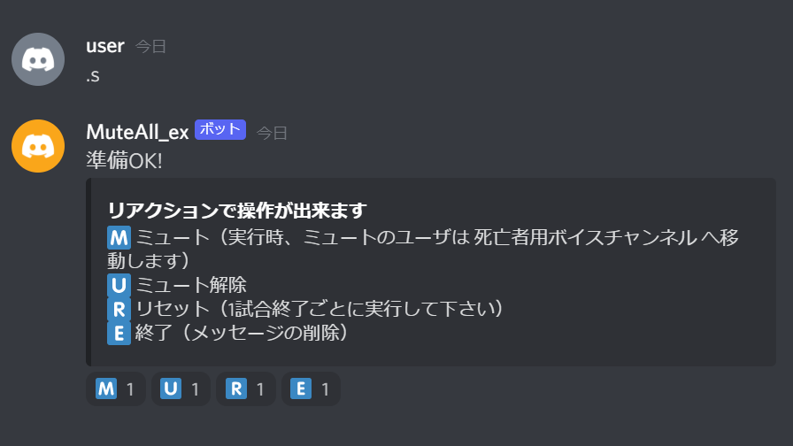

# MuteAll_ex
MuteAll_ex は Among Us の会議を Discord のボイスチャットで行う際、全員のミュートを制御することが出来るbotです。


## 出来ること
### リアクションによるミュートの有効/無効化
ミュートの有効/無効化は制御用メッセージのリアクションを押すことで切り替えることが出来ます。</br>



### 生存者/死亡者用ボイスチャンネルの半自動移動
ユーザが死亡者用ボイスチャンネルへ移動すると、ボットが生存者用と死亡者用のボイスチャンネルを適時移動してくれるようになります。</br>
会議を聞かせる為に死亡者を生存者用チャンネルに移動させる場合は自動でミュート状態となります。</br>
</br>
ボットがユーザを移動する条件は以下の通りです

- ミュート実行時：ユーザがミュート状態の場合、死亡者用ボイスチャンネルへ移動します
- ミュート解除時：死亡者用ボイスチャンネルにいた場合、生存者用ボイスチャンネルへミュート状態で移動します


#### 注意点：死亡者用ボイスチャンネルへの移動について
インポスターにキルされた場合、次の会議が開かれるまで死亡者用ボイスチャンネルに移動しないで下さい（他ユーザにキルタイミングを教えてしまい、インポスター側が不利になることを防ぐためです）。


### 複数ボットによる処理の高速化
ボットアカウントは1つでも動作させることが可能ですが、複数のボットを使用し処理を分散させることも可能です。</br>
参加人数が多く一部のユーザのミュート処理が遅れる場合に有効です。</br>


## セットアップ方法
セットアップには以下の作業が必要です
- Discord botアカウントの作成
- Discordサーバの設定
- bot起動用設定ファイル (config.json) 編集
- ボットの実行環境作成


### Discord botアカウントの作成
1. 開発者サイトにログイン
	- Discord Developer Portal https://discordapp.com/developers/applications/
1. "Applications" タブの ”New Application" を選択しアプリケーションを作成、</br>
	"My Applications" から作成したアプリケーションを選択
	- "General Information" タブで以下の項目を設定
		- APP ICON：ボットのアイコン（設定は任意です）
		- NAME：ボットのユーザ名
	- "Bot" タブで "Add Bot" を選択、以下の項目を設定
		- PRESENCE INTENT：有効
		- SERVER MEMBERS INTENT：有効


### Discordサーバの設定
1. ボットアカウントの追加</br>
	1. "My Applications" から作成したアプリケーションの</br>
		"OAuth2" タブの "OAuth2 URL Generator" にある "bot" にチェックを入れ、下に表示されるURLをコピー
	1. コピーしたURLにアクセスし、"サーバーに追加" からボットを追加したいサーバを選択し "承認" を選択
1. ボットアカウントに管理者または以下の権限があるロールを付与
	- メッセージを送信
	- メッセージの管理
	- メッセージ履歴を読む
	- リアクションの追加
	- メンバーをミュート
	- メンバーのスピーカーをミュート
	- メンバーを移動
1. ボイスチャンネル2部屋（生存者部屋、死亡者部屋）を作成</br>
 	作成するボイスチャンネルの名前は任意のものでOK
1. ロール @everyone または参加メンバに以下の権限があるロールを付与</br>
　※不具合があった場合誰でもサーバーミュートを解除できるようにする為</br>
	- メンバーをミュート
	- メンバーのスピーカーをミュート


### bot起動用設定ファイル (config.json) 編集
config_template.json をコピーし名前を config.json に変更して以下の編集を行って下さい
- トークン (token)
	1. [開発者サイト](https://discordapp.com/developers/applications/) のボット用アプリケーション "Bot" タブの</br>
	"TOKEN" 項目にある "COPY" を選択（トークンは他人に知られないよう管理して下さい）
	1. "token" の行、右側 " " の中にコピーしたトークン文字列を貼り付け
		- 複数のボットを利用する場合は , で区切り ["トークン1", "トークン2", ... "トークンN"] となるよう記述して下さい
- 生存者部屋 (survivors_voice_channel_id)
	1. 生存者部屋ボイスチャンネルを右クリックして "IDをコピー" を選択
	1. "survivors_voice_channel_id" の行、: の右側にコピーしたIDを貼り付け
- 死亡者部屋 (corpses_voice_channel_id)
	1. 生存者部屋ボイスチャンネルを右クリックして "IDをコピー" を選択
	1. "corpses_voice_channel_id" の行、: の右側にコピーしたIDを貼り付け
- ボット稼働テキストチャンネル (command_enable_text_channel_id)
	1. ボットを動作させるテキストチャンネルを右クリックして "IDをコピー" を選択
	1. "command_enable_text_channel_id" の行、: の右側にコピーしたIDを貼り付け

<summary>config.json のサンプル</summary>

<pre>
{
    "token": ["AbCD1EFgH2IKLm3nOPQ4RsTU.VWxYZ5.ABCd6eFGH7IjKL8MNOp9qRST_UvWX1YZ"],
    "survivors_voice_channel_id": 12345678901234567890,
    "corpses_voice_channel_id": 12345678901234567891,
    "command_enable_text_channel_id": 12345678901234567892
}
</pre>
複数のボットで分散処理させる場合
<pre>
{
    "token": ["AbCD1EFgH2IKLm3nOPQ4RsTU.VWxYZ5.ABCd6eFGH7IjKL8MNOp9qRST_UvWX1YZ", "BbCD1EFgH2IKLm3nOPQ4RsTU.VWxYZ5.ABCd6eFGH7IjKL8MNOp9qRST_UvWX1YZ"],
    "survivors_voice_channel_id": 12345678901234567890,
    "corpses_voice_channel_id": 12345678901234567891,
    "command_enable_text_channel_id": 12345678901234567892
}
</pre>


### ボット動作環境作成
1. Python のインストール
	- Pythonのインストーラをダウンロードしインストール（本ボットは3.9.*系で動作確認しています）
		- インストールする際 "Add Python *.* to PATH" の項目にチェックを付けて下さい
		- Python公式 https://www.python.org/
1. pipenv のインストール
	- コマンドプロンプトやターミナルなどで ```pip install pipenv``` または ```pip3 install pipenv``` を実行
	- 環境変数 ```PIPENV_VENV_IN_PROJECT``` に ```true``` を設定
1. 実行に必要なパッケージのインストール
	- MuteAll_ex がある場所でコマンドプロンプトやターミナルなどを開き ```pipenv install``` を実行


## ボットの起動方法
- MuteAll_ex がある場所でコマンドプロンプトやターミナルなどを開き ```pipenv run MuteAll.py``` を実行
	- ボットのアカウントがオンラインになればOK


## 基本機能（コマンド）
- ```.s``` ```.start``` ミュート/ミュート解除をリアクションで操作するメッセージの作成
- ```.h``` ```.help``` ```.H``` ```.Help``` コマンドの説明


## トラブル時の対応
### ボットによるミュート状態から解除されなくなった場合
ボイスチャンネルの該当ユーザを右クリックし "サーバーミュート" のチェックを外すことで解除出来ます。</br>
ボットは1ユーザずつミュート/ミュート解除を実行しており若干時間がかかる場合がある為、</br>
通常は数十秒程度待ってから手動でサーバーミュートのチェックを外して下さい。</br>


### ボットがエラーメッセージを出力した場合
エラーメッセージに対応方法が書いてある場合はそれを試して下さい。</br>
対応方法が書かれていない場合、解決できなかった場合などはボットを再起動して下さい。</br>


## Links
### 使用ライブラリなどのライセンス
- discord.py</br>
Copyright (c) 2015-present Rapptz</br>
https://github.com/Rapptz/discord.py/blob/master/LICENSE</br>

- MuteAll</br>
Copyright (c) 2020 zahid47</br>
https://github.com/zahid47/MuteAll/blob/master/LICENSE</br>
参考元コミット (4f04b906584ba39f124153a61abe3c705bd917f2)</br>
